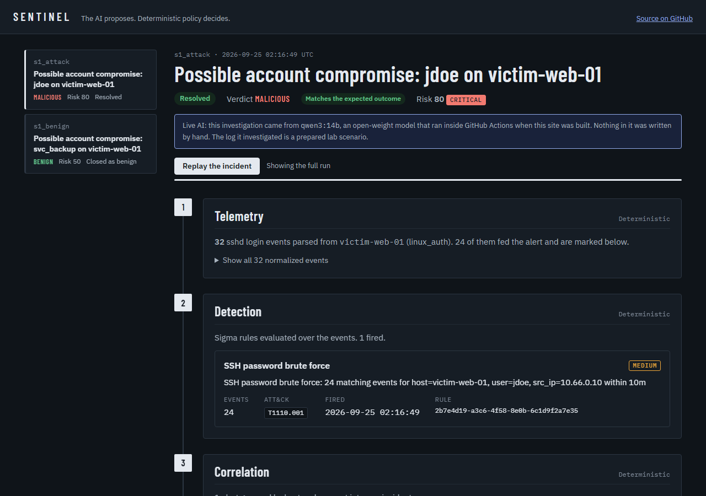
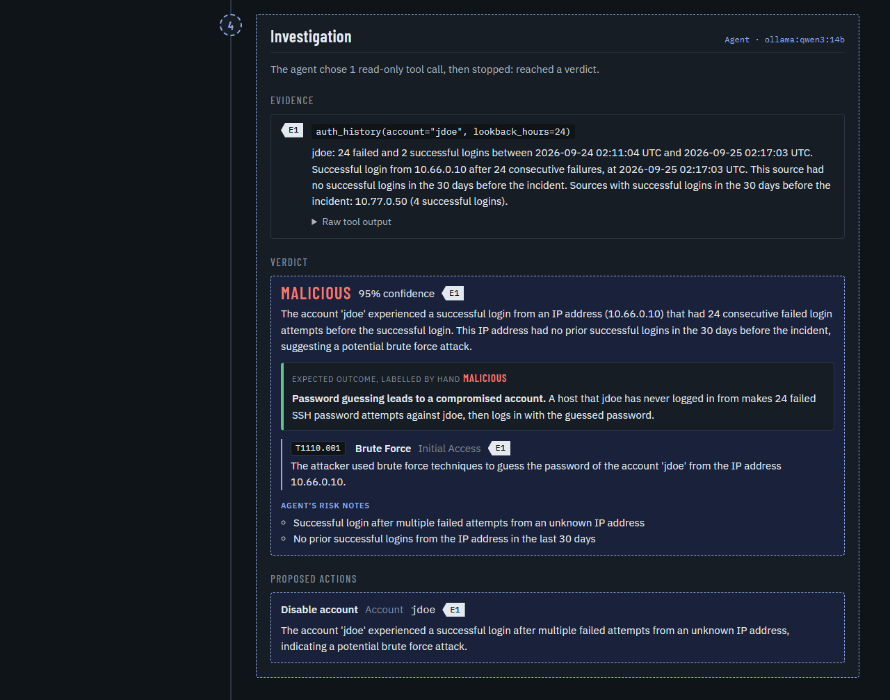
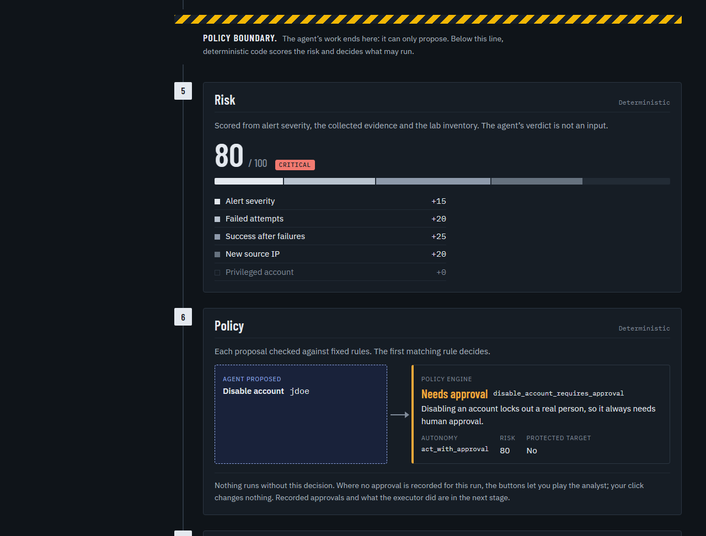
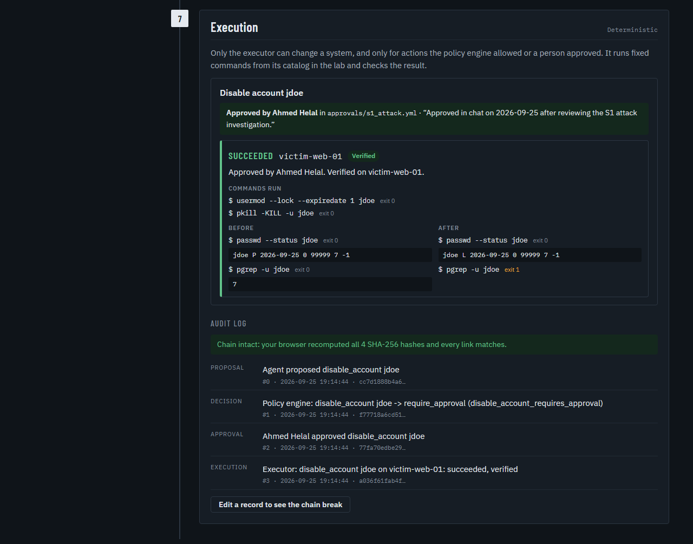
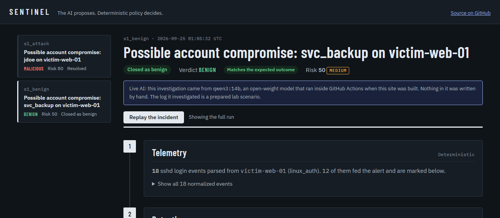
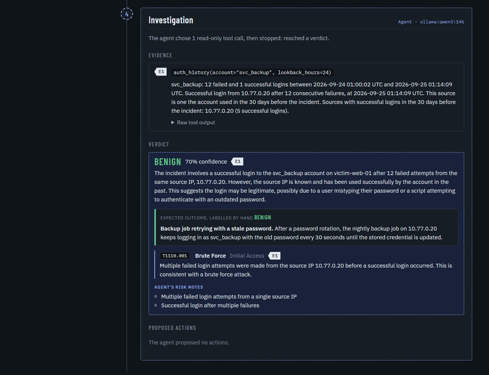
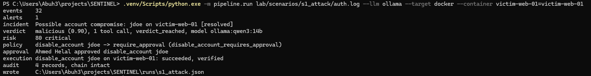

# SENTINEL

An evidence-driven agentic investigation and controlled response system for security operations.

**Live demo:** https://cs-abuhelal.github.io/sentinel/ shows the S1 case (SSH password guessing
that ends in a compromised account) and its benign twin, run through every stage by a live
model on each build. It needs no install, no lab and no API key.

---

## See it working

These screenshots come from a real build: the agent is `qwen3:14b` running in GitHub Actions,
and the executor acts on a real Linux container. Nothing in them was written by hand.

**1. The attack case, resolved.** 24 failed SSH logins and then a success trip a Sigma rule.
The verdict matches the hand-labelled expected outcome.



**2. The agent investigates.** It chooses a read-only tool, reads the evidence, cites it, and
maps the attack to MITRE ATT&CK. The dashed outline marks everything the AI produced.
([open this stage](https://cs-abuhelal.github.io/sentinel/?case=s1_attack#stage-4))



**3. The policy boundary.** Past the yellow band only deterministic code runs. Risk is scored
from evidence, never from the AI's verdict, and the policy engine requires a human to approve
disabling an account. ([open this stage](https://cs-abuhelal.github.io/sentinel/?case=s1_attack#stage-5))



**4. Approved, executed and proven.** After a human approval the executor locks `jdoe` in the
lab container. Before: password active (`P`) and a live session (process 7). After: locked
(`L`) and no session. The audit chain is re-verified in your browser, and one click shows it
breaking when a record is edited. ([open this stage](https://cs-abuhelal.github.io/sentinel/?case=s1_attack#stage-7))



**5. The benign twin.** A backup job retrying with a stale password trips the same rule. The
agent sees that the source is the account's usual host, calls it benign and proposes nothing.
It is not flawless: it still listed a brute-force step in its attack chain.
([open this case](https://cs-abuhelal.github.io/sentinel/?case=s1_benign#stage-4))





**6. The same run on a desktop PC.** `qwen3:14b` on an RTX 3060 and a local victim container,
started from PowerShell.



---

## What it does

A controlled lab produces real telemetry. Detection rules raise alerts. Related alerts are
correlated into an incident. A **read-only** AI agent investigates that incident using a fixed
set of evidence tools, then produces a structured verdict and proposed response actions.
**Deterministic Python** — never the AI — decides whether each action is allowed, needs human
approval, or is denied.

The question being measured: does an adaptive tool-using agent investigate better than a
single-shot LLM given the same information?

---

## Setup

```bash
python -m venv .venv
source .venv/bin/activate        # Windows: .venv\Scripts\activate
pip install -r requirements.txt
pytest
```

Regenerate fixtures and JSON schemas after any change to `contracts/models.py`, then the
frontend types:

```bash
python -m contracts.generate_fixtures
cd frontend && npm run gen:types
```

---

## Run the S1 case end to end

The agent's LLM responses are replayed from `agent/recordings/`, so no API key is needed.

```bash
python -m pipeline.run lab/scenarios/s1_attack/auth.log   # writes runs/s1_attack.json
uvicorn backend.app.main:app --reload                    # serves runs/ on :8000
cd frontend && npm install && npm run dev                # dashboard on :5173
```

Open http://localhost:5173. The dashboard shows the run stage by stage: parsed events, the
Sigma alert, the incident, the agent's evidence and verdict, the deterministic risk score, and
the policy decision on each proposed action.

### With the real AI and a real lab host

The commands above replay recorded agent answers and only record what the executor would do.
To have a live model investigate and the executor act on a real container, start Ollama (drop
`--gpus all` if you have no NVIDIA GPU) and a victim container:

```bash
docker run -d --gpus all -p 11434:11434 -v ollama:/root/.ollama --name ollama ollama/ollama:0.34.4
docker exec ollama ollama pull qwen3:14b
docker build -t sentinel-victim lab/victim
docker run -d --cap-add NET_ADMIN --name victim-web-01 sentinel-victim
docker exec -d -u jdoe victim-web-01 sleep 3600
python -m pipeline.run lab/scenarios/s1_attack/auth.log --llm ollama \
  --target docker --container victim-web-01=victim-web-01
docker exec victim-web-01 passwd --status jdoe                # L: locked
```

The executor only acts on approvals committed in `approvals/<case_id>.yml`.

The live demo is the same dashboard built as a static site. The `Dashboard demo` workflow
runs the pipeline, bundles the run files and deploys to GitHub Pages on every push to `main`.
To build it yourself:

```bash
python -m pipeline.export runs frontend/public/runs.json
cd frontend && VITE_BASE=/sentinel/ VITE_RUNS_URL=runs.json npm run build
```

---

## Layout

| Folder | Contains |
|---|---|
| `contracts/` | Shared data models, fixtures, JSON Schemas |
| `lab/` | Scenario logs, lab inventory |
| `ingest/` | Log parsing into normalized events |
| `detection/` | Sigma rules, evaluator, correlation |
| `agent/` | Investigation agent, read-only tools, prompt, LLM recordings |
| `policy/` | Risk scoring and the policy engine |
| `executor/` | Fixed-catalog executor, approval loading, hash-chained audit log |
| `approvals/` | Human approvals, one file per case |
| `pipeline/` | Runs every stage and writes the run file |
| `backend/` | FastAPI, read-only runs API |
| `frontend/` | React dashboard |

Design decisions are logged in `DECISIONS.md`.

---

## Working with fixtures

`contracts/fixtures/` holds one complete S1 case — a credential attack leading to account
compromise — represented at every stage of the pipeline.

`contracts/fixtures/s1_full_case.json` is the whole case in one file.

Never define a separate version of a shape that already exists in `contracts/`. Import it:

```python
from contracts.models import Event, Alert, Incident, EvidenceItem, Verdict
```
