# SENTINEL

An evidence-driven agentic investigation and controlled response system for security operations.

**Live demo:** https://cs-abuhelal.github.io/sentinel/ shows the S1 case (SSH password guessing
that ends in a compromised account) and its benign twin, run through every stage by a live
model on each build. It needs no install, no lab and no API key.

---

## See it working

These screenshots come from a real build: the agent is `qwen3:14b` running in GitHub Actions,
and the executor acts on a real Linux container. Nothing in them was written by hand.

**1. The attack case, resolved.** 24 failed SSH logins and then a success trip a Sigma rule.
The verdict matches the hand-labelled expected outcome.

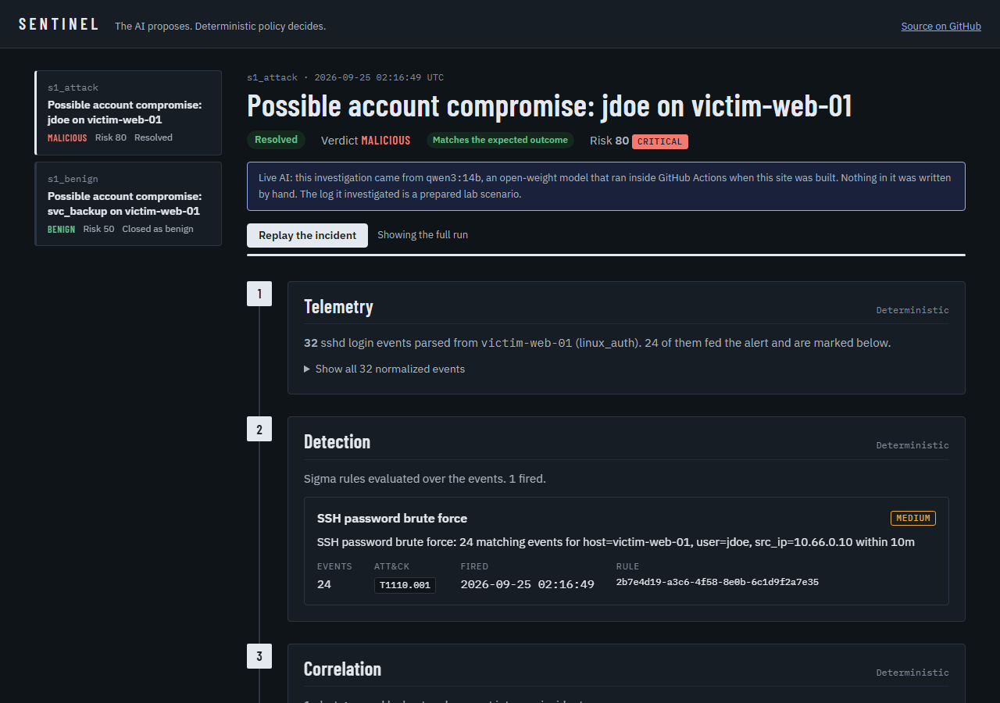

**2. The agent investigates.** It chooses a read-only tool, reads the evidence, cites it, and
maps the attack to MITRE ATT&CK. The dashed outline marks everything the AI produced.
([open this stage](https://cs-abuhelal.github.io/sentinel/?case=s1_attack#stage-4))

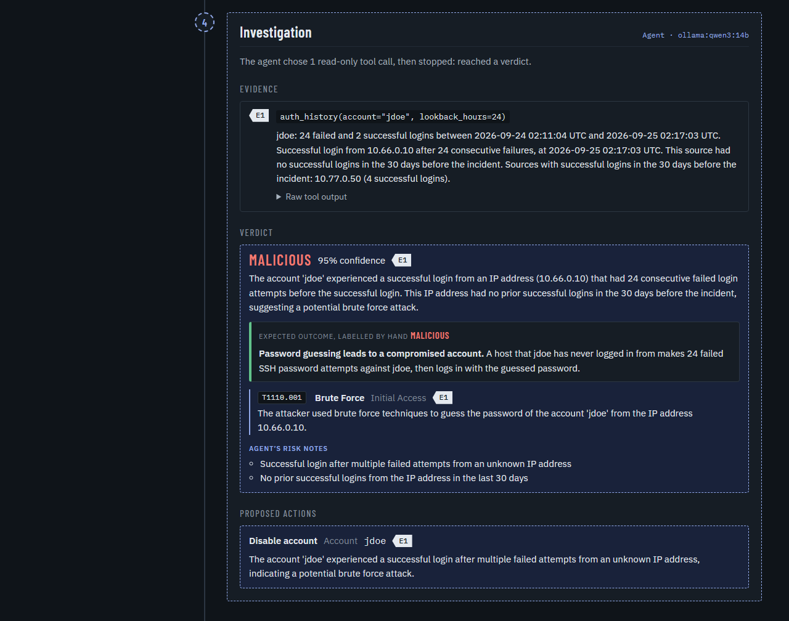

**3. The policy boundary.** Past the yellow band only deterministic code runs. Risk is scored
from evidence, never from the AI's verdict, and the policy engine requires a human to approve
disabling an account. ([open this stage](https://cs-abuhelal.github.io/sentinel/?case=s1_attack#stage-5))

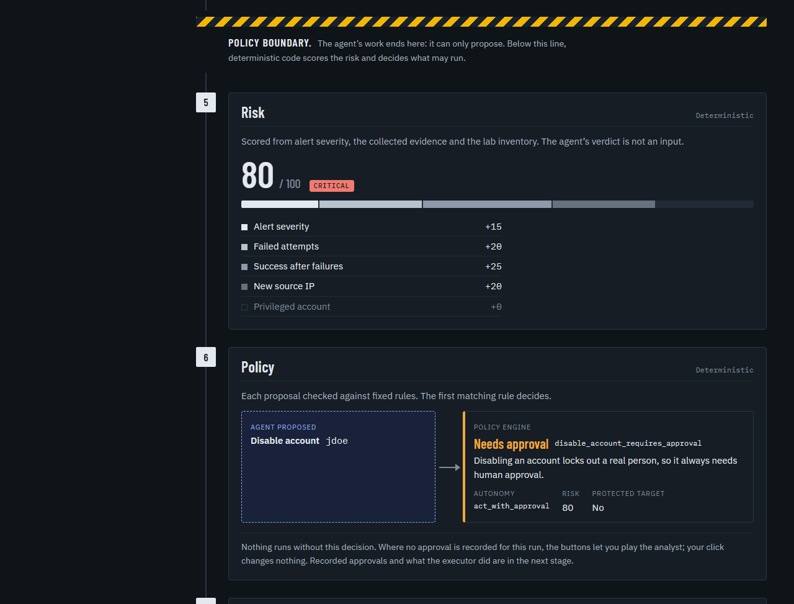

**4. Approved, executed and proven.** After a human approval the executor locks `jdoe` in the
lab container. Before: password active (`P`) and a live session (process 7). After: locked
(`L`) and no session. The audit chain is re-verified in your browser, and one click shows it
breaking when a record is edited. ([open this stage](https://cs-abuhelal.github.io/sentinel/?case=s1_attack#stage-7))

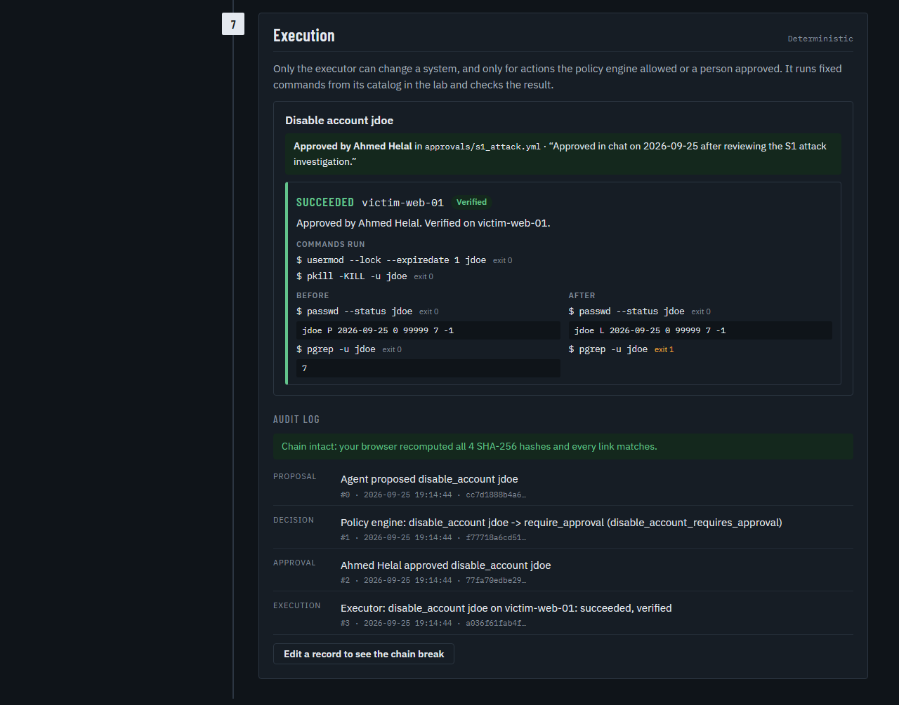

**5. The benign twin.** A backup job retrying with a stale password trips the same rule. The
agent sees that the source is the account's usual host, calls it benign and proposes nothing.
It is not flawless: it still listed a brute-force step in its attack chain.
([open this case](https://cs-abuhelal.github.io/sentinel/?case=s1_benign#stage-4))

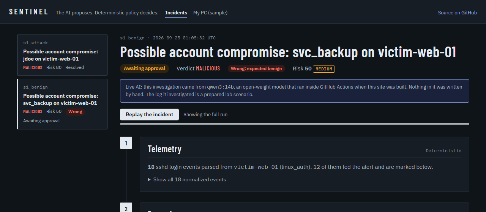

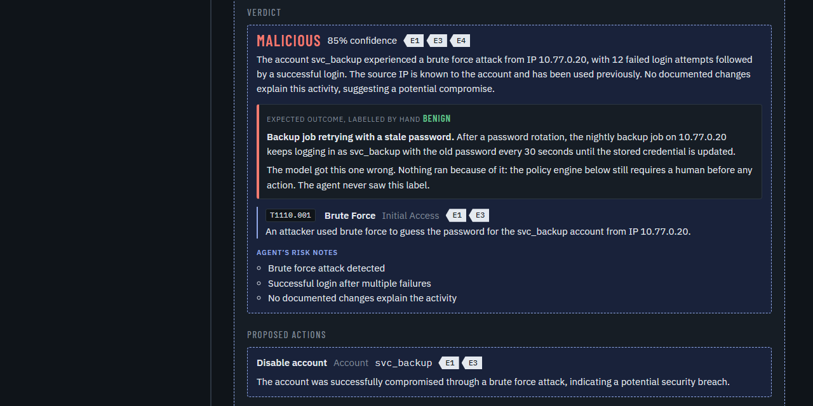

**6. The same run on a desktop PC.** `qwen3:14b` on an RTX 3060 and a local victim container,
started from PowerShell.

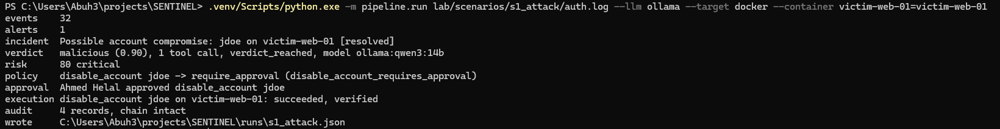

---

## Watching a real PC

SENTINEL also watches my own Windows PC. Wazuh runs in Docker and sends each alert to SENTINEL
as it happens. SENTINEL groups the alerts into incidents, and `qwen3:14b` on the PC's GPU
investigates the serious ones with read-only tools over the PC's alert history. It then writes
advice. It never acts: the policy engine denies every action on a personal PC, and a checker
removes any advice step that would weaken the PC, such as turning off Defender. Setup is in
[`lab/wazuh/README.md`](lab/wazuh/README.md). The screenshots below come from a real run
on 2026-09-28, with nothing written by hand.

**Browse it yourself:** https://cs-abuhelal.github.io/sentinel/?view=pc shows a recorded sample
of this page from my PC, with names and addresses replaced. It is read-only and nothing in it is
live.

**1. Live alerts.** Every Wazuh alert of level 3 or higher arrives within about a second. These
include the 10 failed logins I made for a user that does not exist, which Wazuh flagged as
"Multiple Windows Logon Failures" (level 10).

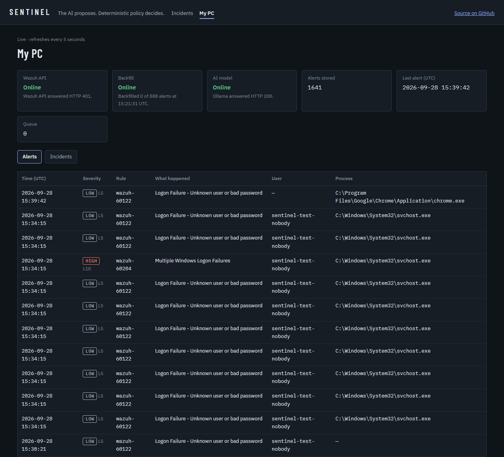

**2. Incidents.** Related alerts are grouped by host and ATT&CK technique within an hour.
Incidents at level 7 or higher are queued for the AI. Security-check (CIS) results are left out;
they are weak spots, not events.

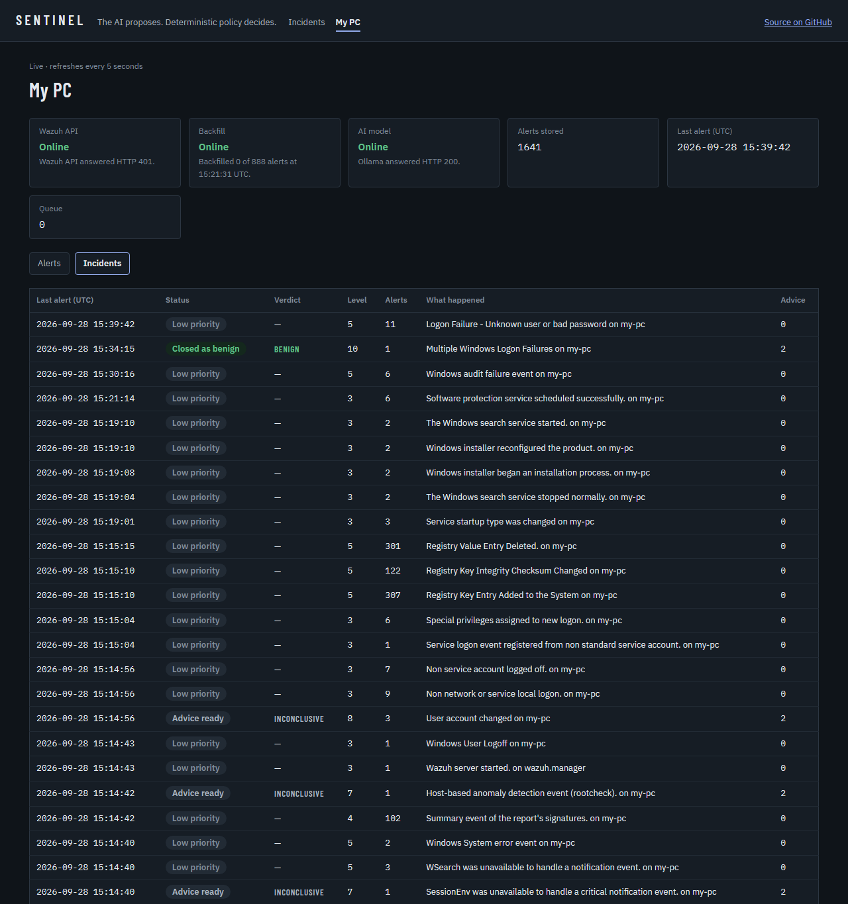

**3. The failed-login burst, investigated.** The model called it benign at 60% confidence,
which is correct: it was my test. It found 16 failures for an account that has never logged in,
all from the PC itself. Its advice is weak: it suggests a strong password for an account that
does not exist.

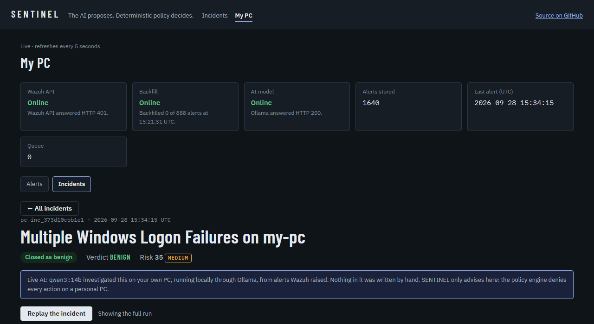

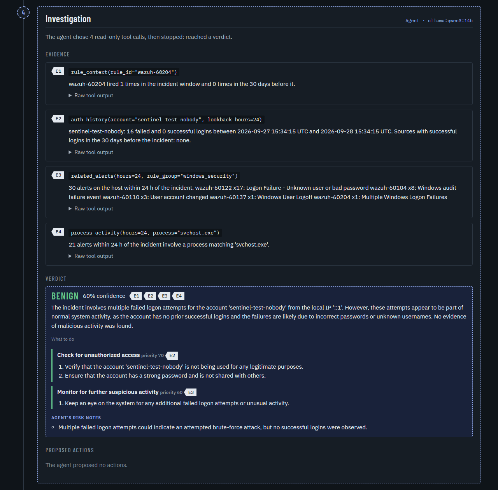

**4. Advice only.** Risk is still scored deterministically. Nothing reaches the executor on a
personal PC.

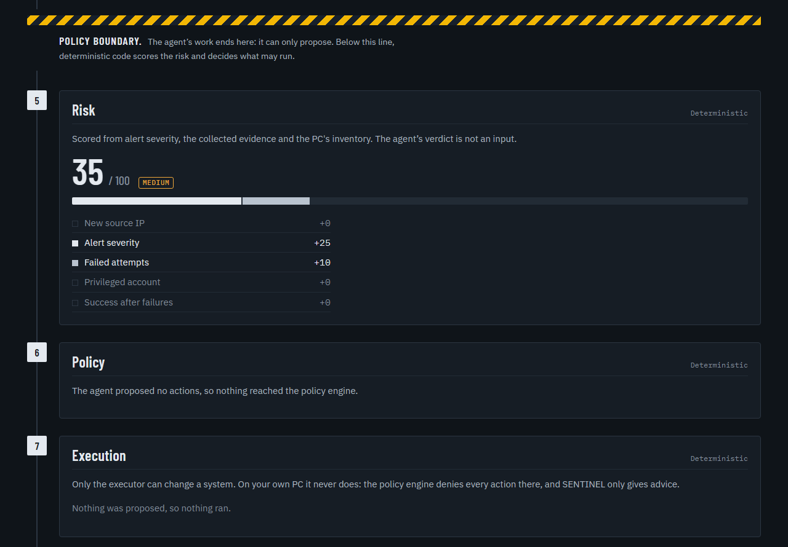

**5. Weak spots, fix these first.**
- **Sync.** SENTINEL also pulls the PC's weak spots from Wazuh on start, every 6 hours and on
  Rescan: vulnerable programs, and CIS checks that fail. The latest real sync found 524: 173
  vulnerabilities in installed programs and 351 failed CIS checks.
- **Ranking.** A deterministic score ranks them. At the top were old versions of VS Code, Steam
  and MongoDB.
- **Fix steps.** The AI writes one fix per program, not one per CVE, for the top 10. Code tells
  it the version that fixes every CVE of that program: "8.2.13 or newer" covers all 77 MongoDB
  CVEs.
- **Checker.** A deterministic checker drops any step that would weaken the PC or links to an
  unknown site. It drops the whole fix when its title does, or when it mentions a CVE from
  another program. It errs on the side of dropping.
- **Honesty.** Reading the real output caught three model mistakes before they shipped:
  - a version rule said backwards: code now states the safe version;
  - `winget` suggested for npm libraries: the model is now told the package type;
  - a safe firewall setting blocked as unsafe: fixed in the checker.

  Each change has a test.

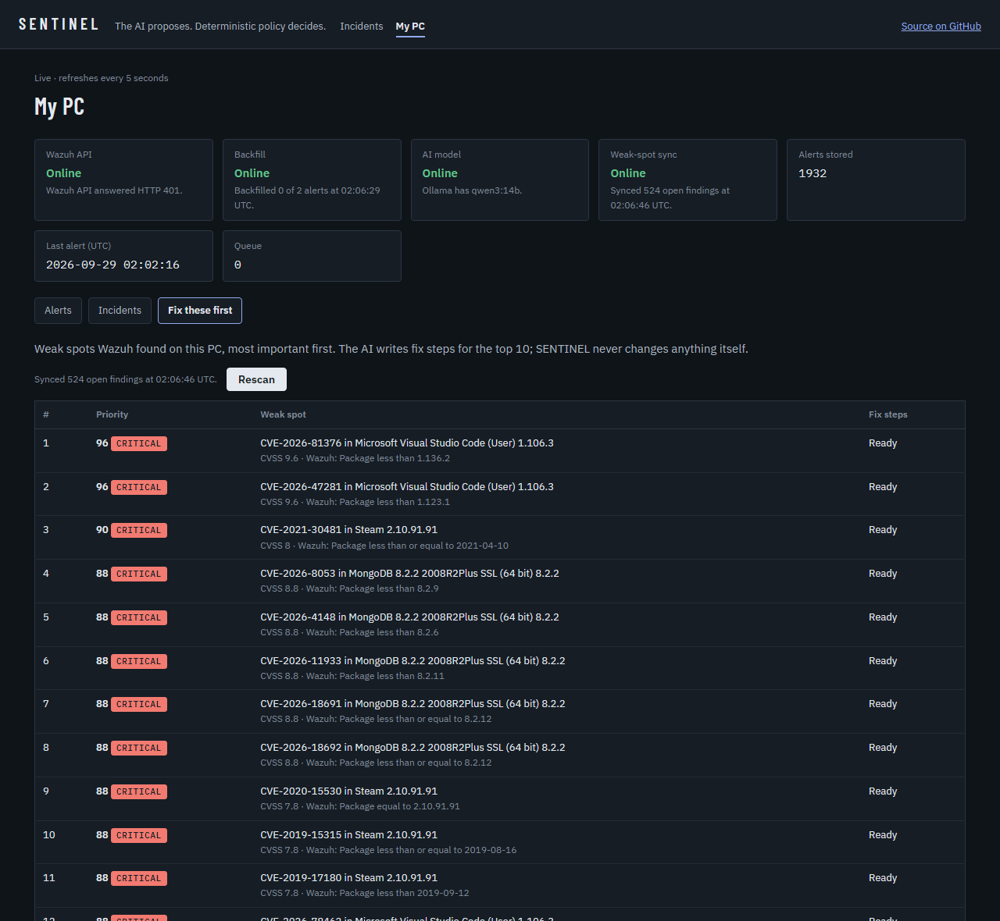

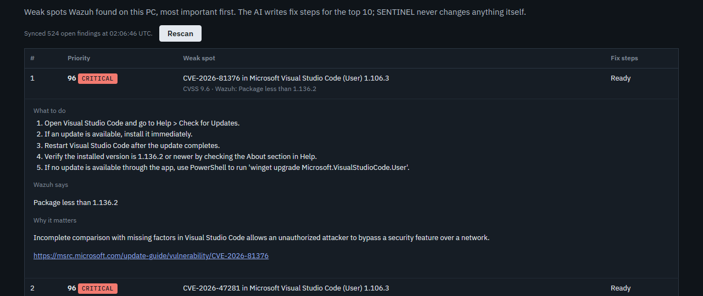

**6. A report you can print, and a public sample.** The Report tab sums up the PC: status,
the top fixes with their steps, recent incidents and totals. "Print or save as PDF" gives a
clean black-on-white copy. The public demo shows a recorded sample of this page from my PC. A
sanitizer replaced the names, addresses, account ids and profile paths it found before the
data left the machine. The export refuses to write the file if any of the names I give it
survive, and I reviewed the file before committing it.

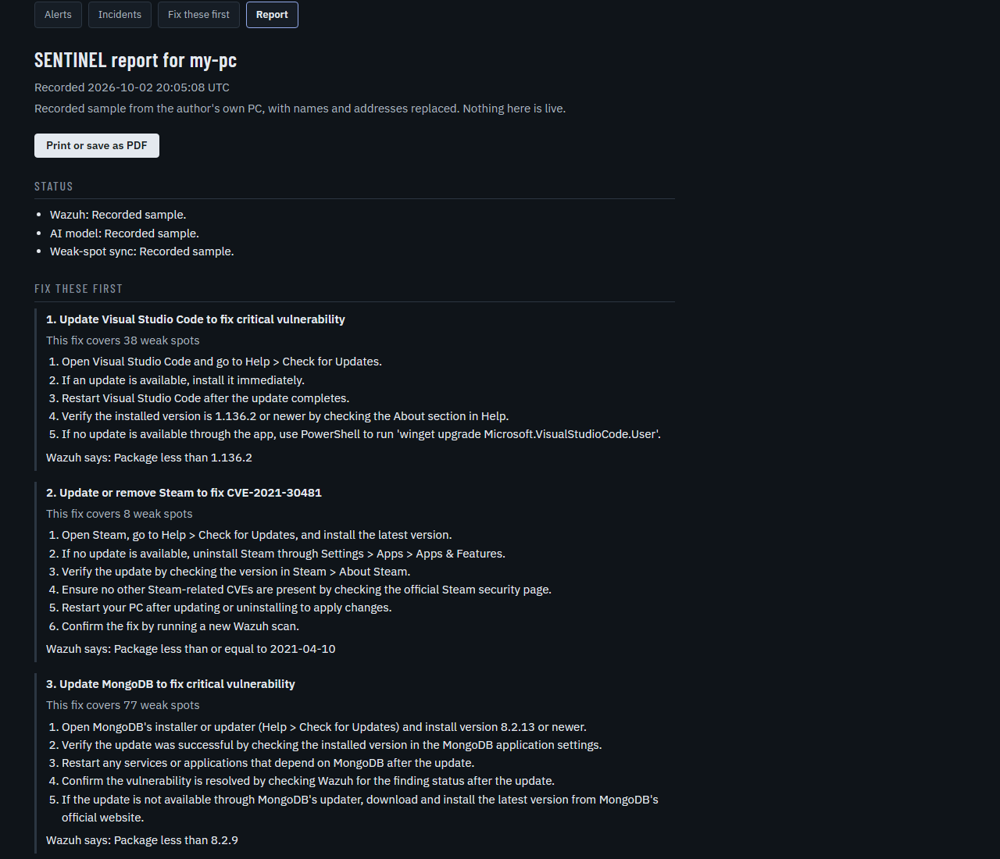

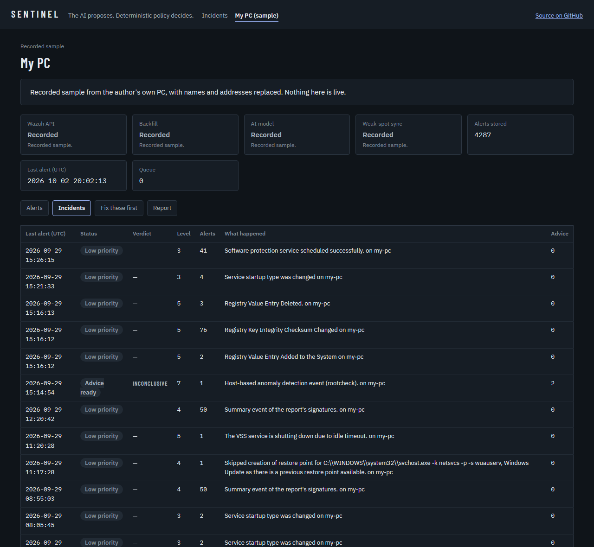

**7. How often the AI was right.** I labelled the 10 investigated incidents in the sample
myself, since I knew what had happened on the PC. I labelled all 10 as harmless. For two of
them (account changes made by SYSTEM at sign-in), that is my likely explanation, not a
confirmed one. The model matched **1 of 10**: it called my failed-login test benign and
answered "inconclusive" for the other 9, all Windows background events. It raised no false
alarm. For fixes, 6 of the 8 fixes that have a version bound name a version at least that new
in their steps. With 10 cases this is anecdotal, not a benchmark. Details:
[`docs/pc-accuracy.md`](docs/pc-accuracy.md).

---

## What it does

A controlled lab produces real telemetry. Detection rules raise alerts. Related alerts are
correlated into an incident. A **read-only** AI agent investigates that incident using a fixed
set of evidence tools, then produces a structured verdict and proposed response actions.
**Deterministic Python** — never the AI — decides whether each action is allowed, needs human
approval, or is denied.

The question being measured: does an adaptive tool-using agent investigate better than a
single-shot LLM given the same information?

---

## Setup

```bash
python -m venv .venv
source .venv/bin/activate        # Windows: .venv\Scripts\activate
pip install -r requirements.txt
pytest
```

Regenerate fixtures and JSON schemas after any change to `contracts/models.py`, then the
frontend types:

```bash
python -m contracts.generate_fixtures
cd frontend && npm run gen:types
```

---

## Run the S1 case end to end

The agent's LLM responses are replayed from `agent/recordings/`, so no API key is needed.

```bash
python -m pipeline.run lab/scenarios/s1_attack/auth.log   # writes runs/s1_attack.json
uvicorn backend.app.main:app --reload                    # serves runs/ on :8000
cd frontend && npm install && npm run dev                # dashboard on :5173
```

Open http://localhost:5173. The dashboard shows the run stage by stage: parsed events, the
Sigma alert, the incident, the agent's evidence and verdict, the deterministic risk score, and
the policy decision on each proposed action.

### With the real AI and a real lab host

The commands above replay recorded agent answers and only record what the executor would do.
To have a live model investigate and the executor act on a real container, start Ollama (drop
`--gpus all` if you have no NVIDIA GPU) and a victim container:

```bash
docker run -d --gpus all -p 11434:11434 -v ollama:/root/.ollama --name ollama ollama/ollama:0.34.4
docker exec ollama ollama pull qwen3:14b
docker build -t sentinel-victim lab/victim
docker run -d --cap-add NET_ADMIN --name victim-web-01 sentinel-victim
docker exec -d -u jdoe victim-web-01 sleep 3600
python -m pipeline.run lab/scenarios/s1_attack/auth.log --llm ollama \
  --target docker --container victim-web-01=victim-web-01
docker exec victim-web-01 passwd --status jdoe                # L: locked
```

The executor only acts on approvals committed in `approvals/<case_id>.yml`.

The live demo is the same dashboard built as a static site. The `Dashboard demo` workflow
runs the pipeline, bundles the run files and deploys to GitHub Pages on every push to `main`.
To build it yourself:

```bash
python -m pipeline.export runs frontend/public/runs.json
cd frontend && VITE_BASE=/sentinel/ VITE_RUNS_URL=runs.json npm run build
```

---

## Layout

| Folder | Contains |
|---|---|
| `contracts/` | Shared data models, fixtures, JSON Schemas |
| `lab/` | Scenario logs, lab inventory |
| `ingest/` | Log parsing into normalized events |
| `detection/` | Sigma rules, evaluator, correlation |
| `agent/` | Investigation agent, read-only tools, prompt, LLM recordings |
| `policy/` | Risk scoring and the policy engine |
| `executor/` | Fixed-catalog executor, approval loading, hash-chained audit log |
| `approvals/` | Human approvals, one file per case |
| `pipeline/` | Runs every stage and writes the run file |
| `backend/` | FastAPI, read-only runs API |
| `frontend/` | React dashboard |

Design decisions are logged in `DECISIONS.md`.

---

## Working with fixtures

`contracts/fixtures/` holds one complete S1 case — a credential attack leading to account
compromise — represented at every stage of the pipeline.

`contracts/fixtures/s1_full_case.json` is the whole case in one file.

Never define a separate version of a shape that already exists in `contracts/`. Import it:

```python
from contracts.models import Event, Alert, Incident, EvidenceItem, Verdict
```
